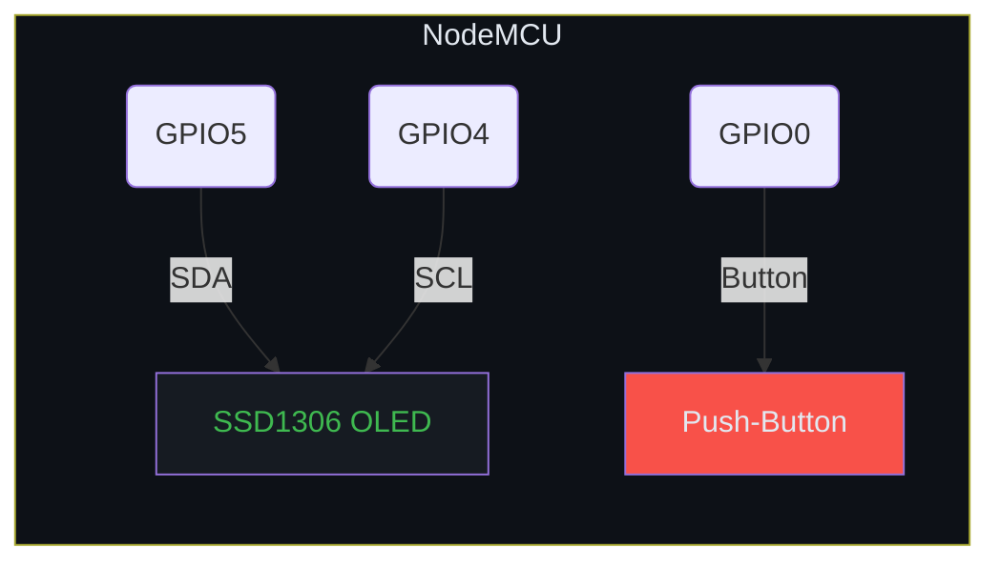
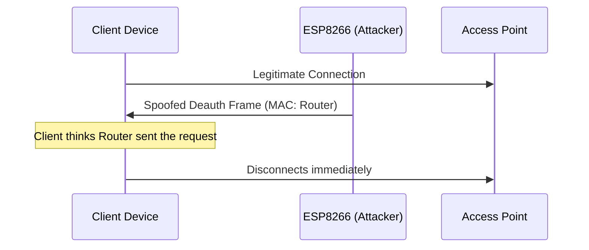

# 

**A hands‑on, educational project that demonstrates the 802.11 deauthentication vulnerability using an ESP8266 board.**

---

## ⚠️ Disclaimer
**Educational use only.** This tool must be used **solely on networks you own or have explicit permission to test**. Unauthorized use constitutes a DoS attack and is illegal. The author disclaims any responsibility for misuse.

---

## 🧐 What is This?
The ESP8266 Deauther runs the open‑source firmware from [SpacehuhnTech](https://github.com/SpacehuhnTech/esp8266_deauther) on a NodeMCU (or Wemos D1 Mini) to send crafted deauthentication frames. Unlike a Wi‑Fi jammer, it **spoofs management frames** that tell a client to disconnect from its Access Point.

---

## 📦 Hardware Used
| Component | Suggested Model |
|----------|-----------------|
| **Microcontroller** | NodeMCU (ESP8266) / Wemos D1 Mini |
| **Display (optional)** | 0.96" I²C SSD1306 OLED |
| **Buttons (optional)** | Tactile push‑buttons |
| **USB Cable** | Micro‑USB Data Cable |
| **Computer** | Windows (for flashing) |

> **Tip:** Adding an OLED & button board turns the Deauther into a **stand‑alone handheld device**. See the wiring guide below.

---

## 🛠️ Wiring Guide (Optional OLED)

*Connect the OLED's **SDA** to **GPIO5 (D1)** and **SCL** to **GPIO4 (D2)**. Wire a momentary button to **GPIO0** for on‑board menu navigation.*

---

## ⚡ How It Works (Protocol Diagram)

*The ESP8266 monitors Wi‑Fi traffic, imitates the router’s MAC address, and injects a deauthentication frame.*

---

## 📥 Installation Guide
1. **Install Drivers** – CP2102 or CH340 depending on your board.
2. **Flash Firmware** – Use the web installer:
   - Connect the ESP8266.
   - Open <https://esp.deauther.com>.
   - Click **Connect**, select the COM port, then **Install Deauther**.
3. **Optional – Build from Source** (PlatformIO / Arduino IDE):
   - Clone the repo.
   - Open `src/main.cpp` and edit `SSID`, `PASSWORD`, or pin assignments.
   - Run `pio run --target upload` or use the Arduino IDE **Upload** button.

---

## 🎮 How to Use
1. Power the ESP8266.
2. Connect to the Wi‑Fi network **`pwned`** (password: `deauther`).
3. Open a browser and navigate to `192.168.4.1`.
4. **Scan** for nearby networks, select your own test network, and launch the **Deauth** attack.

🖼️ Screenshots / Demo GIF

---

## 📊 Attack Reference Matrix
| Attack Type | Target | Stealth | Typical Use‑Case |
|------------|--------|---------|-----------------|
| **Deauth** | Client ↔ AP | Medium (unencrypted Mgmt frames) | Quick disconnect for demo / testing |
| **Beacon Flood** | AP | Low (visible SSIDs) | Create fake networks to fill scan lists |
| **Probe Request Spam** | AP | Low | Overload AP with probe requests |

---

## ❓ FAQ & Troubleshooting (Collapsible)

Why does the ESP8266 keep resetting?

Ensure you have a stable 3.3 V supply and that the **CH340/CP2102** driver is correctly installed. Try a different USB cable.

My computer does not see a COM port.

Install the appropriate driver for your USB‑to‑UART chip (CP2102 for square chips, CH340 for rectangular chips). Re‑plug the board after driver installation.

Can I target WPA‑protected networks?

The deauth attack works on any network that uses **unencrypted management frames** (most WPA/WPA2). Enabling **802.11w (PMF)** on the router mitigates this.

---

## 🗺️ Project Roadmap
- [x] Basic Deauth firmware
- [ ] OLED display support (wireless status)
- [ ] Battery‑powered case (LiPo)
- [ ] Wireshark packet capture guide
- [ ] WPA3‑PMF vulnerability analysis

---

## 🕵️ Wireshark Verification Guide
1. Install Wireshark on your PC.
2. Capture on the Wi‑Fi interface in **monitor mode**.
3. Filter with `wlan.fc.type_subtype == 0x0c` to view deauthentication frames.
4. Verify the **Source MAC** matches the router’s MAC (spoofed by ESP8266).

---

## 🔒 Security Deep‑Dive (WPA3‑PMF)
| Security Mode | Management Frame Encryption | Deauth Feasibility |
|---------------|-----------------------------|-------------------|
| **Open** | None | ✅ Easy |
| **WPA2‑PSK** | None (unencrypted Mgmt) | ✅ Easy |
| **WPA3‑SAE** | Protected Management Frames (PMF) optional | ❌ If PMF enabled |

> **Recommendation:** Enable **802.11w (PMF)** on modern routers to block deauth attacks.

---

## 👏 Credits
- **Firmware Creator:** [SpacehuhnTech](https://github.com/SpacehuhnTech)
- **Documentation & README Modernization:** You (Sheha)

---

*Created for educational exploration of Wi‑Fi security concepts.*
